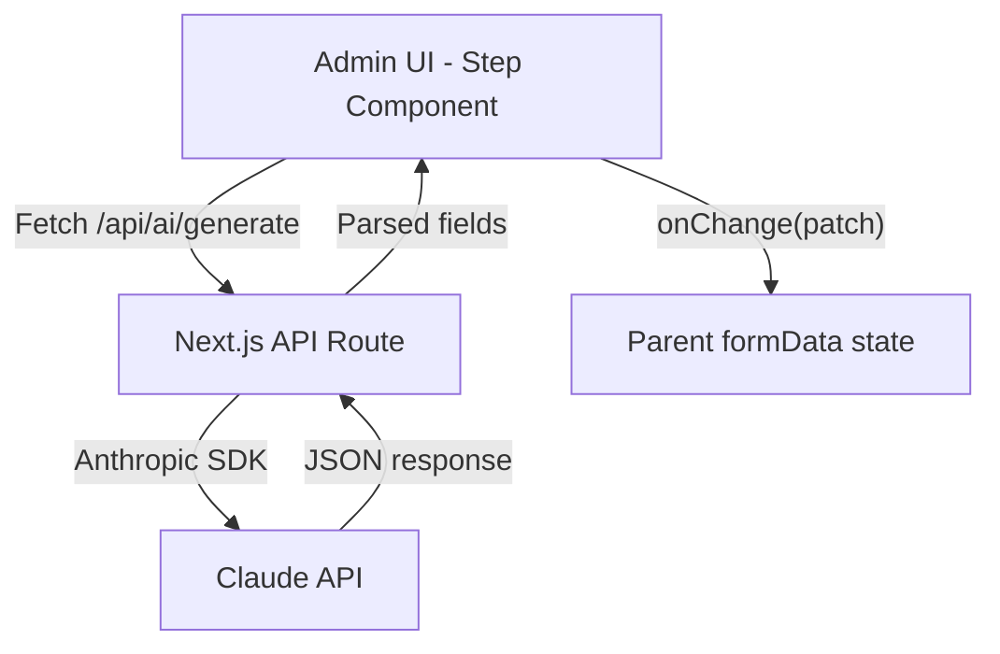

# Plan: Claude AI Content Generation for Create Listing Steps

> **Goal**: Add an "AI Generate" button to each step of the Create Listing wizard that calls Claude (Anthropic) to auto-populate form fields based on contextual prompts and any data the admin has already entered.

---

## Architecture Overview



### Key Design Decisions

| Decision | Choice | Rationale |
|----------|--------|-----------|
| **API Layer** | Next.js Route Handler (`app/api/ai/generate/route.ts`) | Keeps the Anthropic key server-side; single endpoint for all steps |
| **SDK** | `@anthropic-ai/sdk` | Official TypeScript SDK with streaming support |
| **Prompt Strategy** | Step-specific system prompts + user context | Each step gets a tailored prompt that knows which fields to generate |
| **Response Format** | Structured JSON | Claude returns a JSON object matching the step's field schema |
| **UI Pattern** | "✨ AI Generate" button per step + loading state | Non-destructive; admin can review/edit AI output before proceeding |

---

## Implementation Steps

### Phase 1: Backend API Route

#### Step 1.1 — Install Anthropic SDK

```bash
npm install @anthropic-ai/sdk
```

> The `ANTHROPIC_API_KEY` is already set in `.env.local`.

#### Step 1.2 — Create the API Route

**File**: `app/api/ai/generate/route.ts`

Create a single POST endpoint that accepts:

```typescript
interface AIGenerateRequest {
  step: number;             // 1-7 (step 8 is review, no generation needed)
  existingData: {           // All form data collected so far
    title?: string;
    provider?: string;
    tagline?: string;
    city?: string;
    country?: string;
    // ... all ProgramFormData fields
  };
  userPrompt?: string;      // Optional freeform instruction from admin
}
```

Returns:

```typescript
interface AIGenerateResponse {
  fields: Partial<ProgramFormData>;   // Only the fields relevant to the requested step
}
```

**Implementation details:**

1. Import `Anthropic` from `@anthropic-ai/sdk`
2. Initialize client: `new Anthropic()` (auto-reads `ANTHROPIC_API_KEY` from env)
3. Use `claude-sonnet-4-20250514` model
4. Build a step-specific system prompt (see Step 1.3)
5. Send the request and parse the JSON response
6. Return the parsed fields

#### Step 1.3 — Define Step-Specific Prompts

Each step needs a tailored system prompt that instructs Claude on:
- What fields to generate
- The expected data types (string vs string[])
- Context from previously filled fields
- Domain knowledge (study abroad programs)

| Step | Fields to Generate | Prompt Focus |
|------|-------------------|--------------|
| **1 — Basic Info** | `title`, `provider`, `tagline`, `hostInstitution`, `slug` | Generate a compelling program title and tagline. If `provider` is given, suggest a title that fits. Auto-generate slug. |
| **2 — Location** | `city`, `country`, `terms`, `duration` | Based on title/provider, suggest a realistic location. Pick appropriate terms. |
| **3 — Eligibility** | `educationLevels`, `eligibleNationalities`, `ageRequirement` | Suggest typical eligibility criteria for the program type. Education levels must be from: `["freshman", "sophomore", "junior", "senior", "graduate"]`. |
| **4 — Program Details** | `description`, `whatsIncluded` | Write a detailed, engaging 200-400 word description. Suggest 5-8 inclusions. |
| **5 — Subjects & Features** | `subjectAreas`, `highlights` | Suggest relevant academic subjects and 4-6 compelling highlights. |
| **6 — Pricing & Contact** | `cost`, `applicationDeadline`, `housingType`, `languageOfInstruction`, `creditsAvailable` | Suggest realistic pricing and details. Skip `contactEmail`, `contactPhone`, `applyUrl` (admin should provide these). |
| **7 — Media** | `coverImage` | Suggest a relevant Unsplash/Pexels URL based on location. |

**Prompt template structure:**

```
SYSTEM: You are a study abroad program content specialist. Generate realistic, 
compelling content for a GoAbroad.com program listing.

You MUST return a valid JSON object with ONLY these fields: {field_list}

Context from the admin so far:
- Title: {title}
- Provider: {provider}
- City: {city}, Country: {country}
...

{step_specific_instructions}

Return ONLY valid JSON. No markdown, no explanation.
```

---

### Phase 2: Shared AI Generate Button Component

#### Step 2.1 — Create `AIGenerateButton` Component

**File**: `app/admin/create-listing/_components/AIGenerateButton.tsx`

A reusable button component that:

1. Shows a "✨ AI Generate" button with Lucide `Sparkles` icon
2. Accepts props:
   ```typescript
   interface AIGenerateButtonProps {
     step: number;
     formData: ProgramFormData;
     onGenerated: (fields: Partial<ProgramFormData>) => void;
     label?: string;  // Custom button label, defaults to "AI Generate"
   }
   ```
3. On click:
   - Sets loading state (spinner + "Generating..." text)
   - Calls `POST /api/ai/generate` with `{ step, existingData: formData }`
   - On success, calls `onGenerated(response.fields)`
   - On error, shows an inline error message
4. Has a subtle pulse animation while loading
5. Includes an optional text input for custom instructions (expandable)

**Styling**: 
- Use a gradient background (`bg-gradient-to-r from-violet-500 to-fuchsia-500`) to visually distinguish AI actions from regular form controls
- Rounded pill shape (`rounded-full`)
- White text, bold font

---

### Phase 3: Integrate into Each Step Component

#### Step 3.1 — Update Step Component Props

Each step component (`Step1BasicInfo` through `Step7Media`) needs an additional prop:

```typescript
// Add to each step's props interface
formData?: ProgramFormData;  // Full form data for AI context
```

The parent `CreateListingPage` already has `formData` — just pass it down.

#### Step 3.2 — Add AIGenerateButton to Each Step

For each step component, add the `AIGenerateButton` between the step header and the form fields:

```tsx
<div>
  <h2>Basic Information</h2>
  <p>Start with the core details...</p>
</div>

{/* AI Generate Button */}
<AIGenerateButton
  step={1}
  formData={formData}
  onGenerated={(fields) => onChange(fields)}
/>

<div className="space-y-4">
  {/* existing form fields */}
</div>
```

#### Step 3.3 — Files to Modify

| File | Changes |
|------|---------|
| `Step1BasicInfo.tsx` | Add `formData` prop, import & render `AIGenerateButton` with `step={1}` |
| `Step2Location.tsx` | Add `formData` prop, import & render `AIGenerateButton` with `step={2}` |
| `Step3Eligibility.tsx` | Add `formData` prop, import & render `AIGenerateButton` with `step={3}` |
| `Step4ProgramDetails.tsx` | Add `formData` prop, import & render `AIGenerateButton` with `step={4}` |
| `Step5SubjectsFeatures.tsx` | Add `formData` prop, import & render `AIGenerateButton` with `step={5}` |
| `Step6PricingContact.tsx` | Add `formData` prop, import & render `AIGenerateButton` with `step={6}` |
| `Step7Media.tsx` | Add `formData` prop, import & render `AIGenerateButton` with `step={7}` |
| `page.tsx` (create-listing) | Pass `formData` prop to each step component |

---

### Phase 4: Parent Page Integration

#### Step 4.1 — Update `CreateListingPage` Step Rendering

In `app/admin/create-listing/page.tsx`, update each `renderStep()` case to pass the full `formData`:

```tsx
case 1:
  return (
    <Step1BasicInfo
      data={{ title: formData.title, provider: formData.provider, ... }}
      onChange={updateFormData}
      formData={formData}  // ← NEW: for AI context
    />
  );
// ... repeat for all steps
```

---

### Phase 5: Optional Enhancements

#### 5.1 — "Generate All" Button on Step 1

Add a special "✨ Generate Entire Listing" button on Step 1 that:
- Calls the API once with `step: 0` (special value)
- Claude generates ALL fields at once
- Populates the entire form, enabling instant step-skipping

#### 5.2 — Field-Level Generation

For the description field (Step 4), add a smaller inline "✨ Improve" button that:
- Takes the existing description text
- Asks Claude to refine/expand it
- Replaces only that single field

#### 5.3 — Streaming Response

Use Claude's streaming API to show text appearing in real-time for the description field, giving a premium "writing" feel.

#### 5.4 — Generation History

Store the last 3 AI generations in local state so the admin can cycle through alternatives with "← Previous" / "Next →" buttons.

---

## File Structure (New Files)

```
app/
├── api/
│   └── ai/
│       └── generate/
│           └── route.ts              ← API route handler
└── admin/
    └── create-listing/
        └── _components/
            └── AIGenerateButton.tsx   ← Shared AI button component
```

## File Structure (Modified Files)

```
app/admin/create-listing/
├── page.tsx                          ← Pass formData to steps
└── _components/
    ├── Step1BasicInfo.tsx             ← Add AI button
    ├── Step2Location.tsx              ← Add AI button
    ├── Step3Eligibility.tsx           ← Add AI button
    ├── Step4ProgramDetails.tsx        ← Add AI button
    ├── Step5SubjectsFeatures.tsx      ← Add AI button
    ├── Step6PricingContact.tsx        ← Add AI button
    └── Step7Media.tsx                 ← Add AI button
```

## Dependencies

| Package | Version | Purpose |
|---------|---------|---------|
| `@anthropic-ai/sdk` | Latest | Official Claude API client |

## Environment Variables

| Variable | Location | Status |
|----------|----------|--------|
| `ANTHROPIC_API_KEY` | `.env.local` | ✅ Already configured |

---

## Execution Order

> Follow this order to avoid breaking changes:

1. **Install SDK** → `npm install @anthropic-ai/sdk`
2. **Create API route** → `app/api/ai/generate/route.ts`
3. **Create AIGenerateButton** → `_components/AIGenerateButton.tsx`
4. **Update parent page** → Pass `formData` to all step components
5. **Update Step1–Step7** → Add `formData` prop + `AIGenerateButton`
6. **Test** → Run locally and verify generation for each step
7. **Polish** → Add loading states, error handling, optional enhancements
